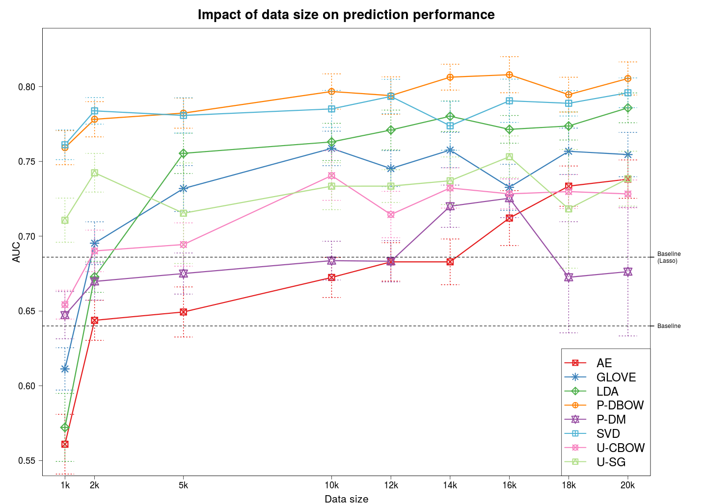

# FB_user_embedding

| file | desc | package |
-------|------|---------|
**00_autoencoder.py** | autoencoder with L2 regularizer | Keras 1.0|
**00_doc2vec.py**     | P-DBOW and P-DB | gensim |
**00_glove.py**       | Glove | glove |
**00_lda.py**         | LDA   | gensim |
**00_svd.py**         | SVD   | scikit-learn |
**00_word2vec.py**    | U-CBOW and U-SG | gensim |

# Current result (Jimmy)
- assumed that we have 1000 users with label_income
- convert the multi-class problem to a binary-class problem using median income as the cutting threshold
- use the same dataset

